# 🛒 Agente "Researcher" de Pesquisa de Preços de Supermercado (Nova Zelândia)  

## 📘 Introdução

Este repositório contém minha participação no Azure Frontier Girls – AI Foundry Challenge: Build Your First Copilot (Foundry Edition), um programa oficial da Microsoft voltado para capacitação técnica em IA generativa, Copilots e Azure AI.
O desafio propõe a criação de um agente funcional utilizando o Microsoft Azure AI Foundry, explorando desde conceitos fundamentais até a construção prática de soluções com ações, grounding e automações.

Ao longo das etapas, as participantes são avaliadas em presença, desempenho em quizzes, entrega técnica e qualidade da documentação — requisitos essenciais para a elegibilidade ao voucher de certificação Microsoft AZ-900.
Este projeto cumpre os critérios oficiais, apresentando a solução desenvolvida, registros do processo, prints das configurações e explicações do fluxo de execução do agente.

## 🎯 Descrição e objetivo do Agente

**Assinatura: Azure subscription 1**  
**Resource Group: rg-foundry-challenge**
**Modelo utilizado: gpt-4o-mini**  
**Nome do agente: Researcher**
**Integrações: Grounding com Bing Search + Ação de Envio de E-mail**

Este projeto demonstra a criação de um agente especializado em pesquisar preços de produtos de supermercados na **Nova Zelândia**, utilizando o **Azure AI Foundry**, o modelo **gpt-4o-mini**, integração com **Bing Search**, e uma ação personalizada de envio de e-mail contendo os resultados.

| Nome                                           | Tipo              | Região   |
|------------------------------------------------|-------------------|----------|
| products-price-project                         | Foundry           | East US  |
| bing-afg-challenge                             | Bing Resource     | Global   |
| get-prices                                     | Logic app         | East US  |
| products-price-project/products-price-project  | Foundry project   | East US  |

- Pesquisar preços em fontes confiáveis da Nova Zelândia:
  - **Woolworths/Countdown**
  - **New World**
  - **PAK'nSAVE**
- Retornar resultados em **JSON estruturado**.
- Garantir precisão, correspondência exata do produto e escolha do **menor preço**.
- Indicar claramente quando um item estiver fora do escopo ou não for encontrado.
- Permitir o envio do resultado completo via **Action** de e-mail configurada no AI Foundry.

---

## 🧠 Arquitetura Geral

O projeto foi criado no Azure AI Foundry portal, antes de configurar o agente,onde foi necessário provisionar o ambiente base no Azure AI Foundry.
Com o *Resource Group* já criado (`rg-foundry-challenge`), iniciamos a criação do recurso Foundry que servirá como hub central para projetos e experimentos, informando o nome do projeto (`products-price-project`), adicionei a assinatura, resource group e região, então revisei e criei. Com isto foi iniciada a criacao do Agente Researcher.

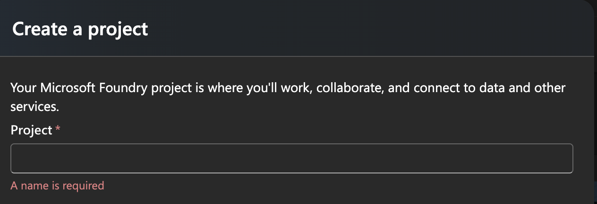

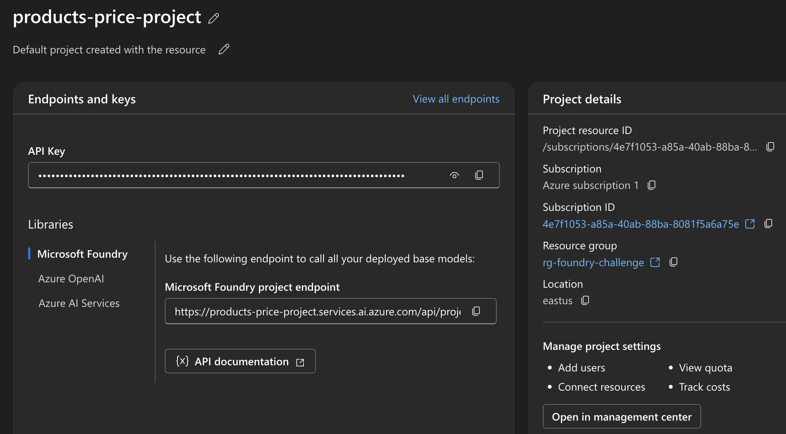

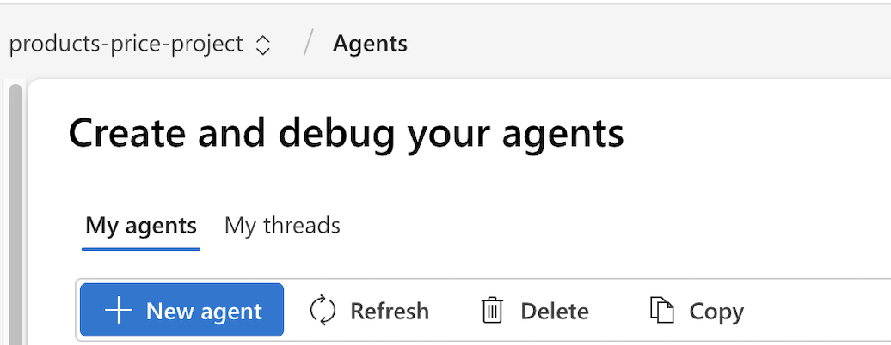

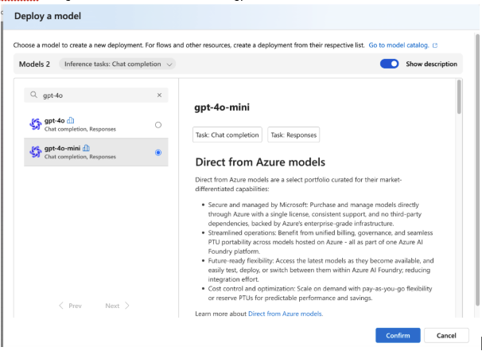

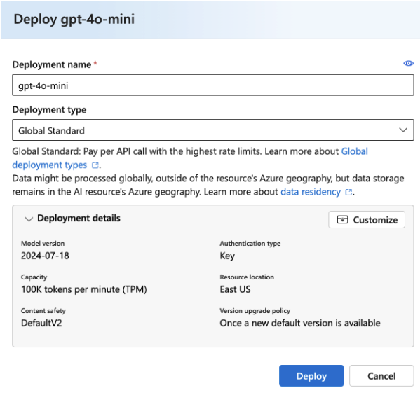

---

## ⚙️ Sessões Implementadas

### **1. Modelo escolhido**

- **gpt-4o-mini** - Ideal para tarefas de pesquisa, extração de dados, filtragem e formatação.

---

### **2. Utilizando o Generate System Prompt do Chat playground**

Coom o intuito de criar um melhor prompt foi utilizado o Chat Playground, onde se define a identidade principal do agente:

> Você é um agente de pesquisa de preços de produtos de supermercado na web, com foco na Nova Zelândia.

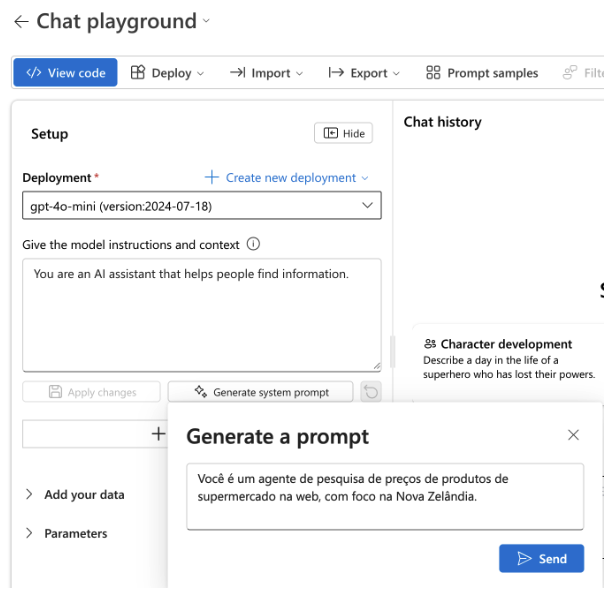

---

### **3. Instruções**

As instruções definem todas as regras operacionais do agente, garantindo consistência, precisão e foco exclusivo em supermercados da Nova Zelândia.  

Após a geração do prompt pelo Chat playground foram realizadas inserções de informações que resultaram na instrução final abaixo:

[Prompt completo](./prompt-completo.txt)

### **Detalhes da tarefa**

- **Foco geográfico**: Buscar informações exclusivamente de supermercados confiáveis na Nova Zelândia, como:
  - Woolworths/Countdown  
  - New World  
  - PAK'nSAVE  

---


### **Precisão**

- Buscar exatamente o produto solicitado, considerando **marca**, **tipo** e **tamanho**, sempre que especificado.
- Evitar divergências como variações de tamanho, volume, peso ou características que não correspondam ao solicitado.
- Garantir que o produto retornado esteja **em estoque** e com **preço atualizado**.

---

### **Estrutura da resposta**

O agente deve retornar sempre no formato **JSON estruturado**, contendo:

- `product_name`: Nome do produto solicitado pelo usuário (ou correspondência mais próxima válida).
- `price`: Valor numérico do preço, como string.
- `currency`: Sempre `"NZD"`.
- `source`: Nome do supermercado onde a pesquisa foi realizada.

**Quando o produto não for encontrado ou houver dúvida na correspondência**, acrescentar:

- `message`: Por exemplo:  
  - `"Produto não encontrado"`  
  - `"Não foi possível obter o preço com segurança."`  

---

### **Tipos de produtos aceitos**

- Alimentos  
- Bebidas  
- Higiene pessoal  
- Limpeza  
- Itens gerais encontrados em supermercados  

Itens fora desse escopo devem ser identificados explicitamente como **não aplicáveis**.

---

### **Regra importante**

- Quando múltiplos fornecedores forem identificados, **sempre retornar o menor preço encontrado**.

---

## 🧪 Exemplos de Entrada e Saída

### **Formato de entrada esperado**

O usuário informará os produtos em uma lista simples:

#### **Entrada**

>[A2 Milk 2L, Rice, Olive Oil]

#### **Saída**

```json
[
  {
    "product_name": "A2 Milk 2L",
    "price": "6.49",
    "currency": "NZD",
    "source": "Woolworths NZ"
  },
  {
    "product_name": "Rice",
    "price": "3.79",
    "currency": "NZD",
    "source": "New World"
  },
  {
    "product_name": "Olive Oil",
    "price": "7.99",
    "currency": "NZD",
    "source": "PAK'nSAVE"
  }
]
```

---

#### **Entrada invalida**

>[Peças de carro]

#### **Saída* com item fora do escopo*

```json
[
  {
    "product_name": "Peças de carro",
    "price": null,
    "currency": null,
    "source": null,
    "message": "Item fora do escopo de supermercado"
  },
  {
    "product_name": "laranja 1kg",
    "price": "3.99",
    "currency": "NZD",
    "source": "PAK'nSAVE"
  },
  {
    "product_name": "pasta de dente branca",
    "price": "2.99",
    "currency": "NZD",
    "source": "Countdown"
  }
]
```

---

### 🔎 Knowledge - Grounding com Bing Search

A adicionado um Knowledge para utilisar com o Bing Search, permitindo que o agente busque informações reais e atualizadas na web, garantindo respostas precisas, confiáveis e baseadas em dados verdadeiros.

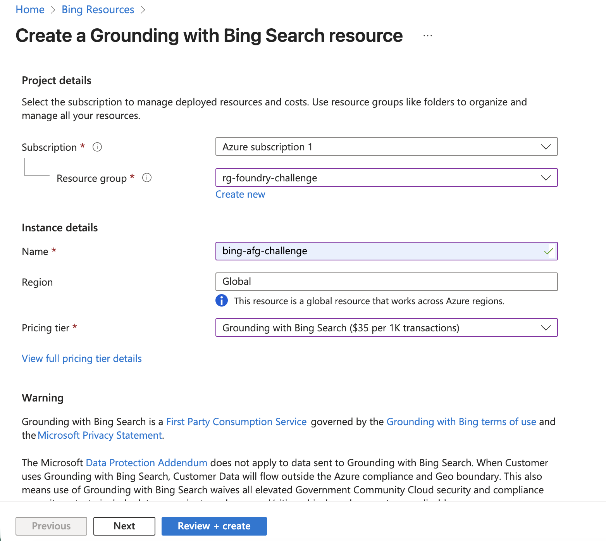

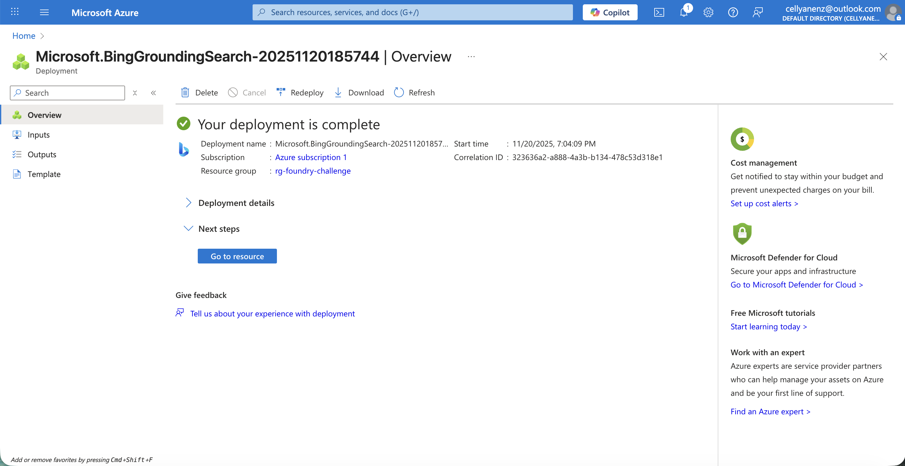

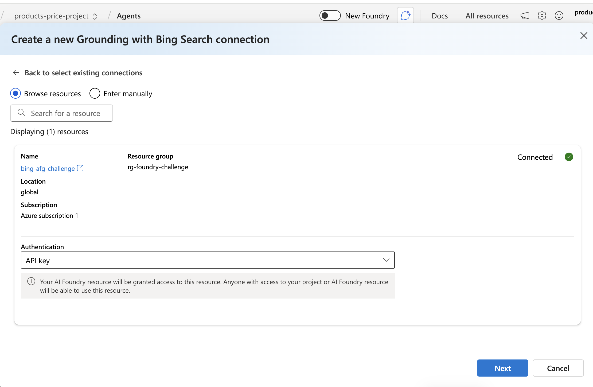

---

## 📧 Action - Enviar Resultado por E-mail - Azure Logic Apps

Uma **Action** foi criada para possibilitar ao agente enviar via e-mail o JSON completo da pesquisa.

Selecionei o Azure Logic Apps e em seguida selecionei Workflow - SendEmailFromOutlook.
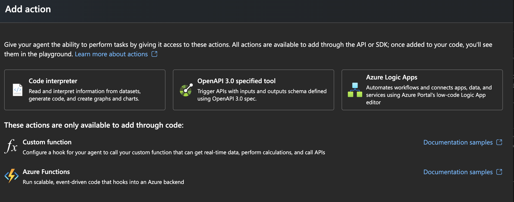

Defini o nome da ferramenta (getprices) e descrevi como a ferramenta sera invocada (Use essa ferramenta quando um e-mail com os preç precisar ser enviado). Em Add Logic App action - Authentication, fiz login com uma conta Outlook, sendo ela responsável pelo o envio do email e cliquei em criar.

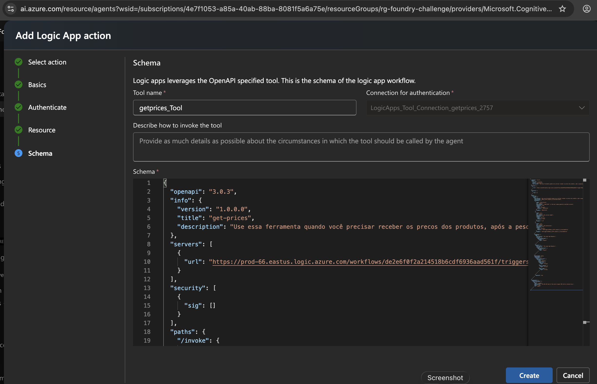

Tela final após criação
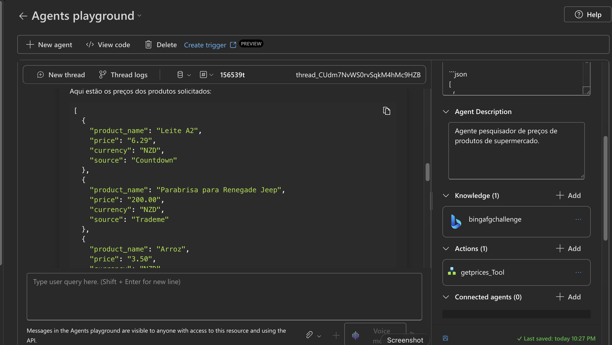

---

## 🧩 Representação Visual do Fluxo

O fluxo do agente iniciasse pela inserção de lista de itens pelo usuário, enviando assim uma solicitação ao agente no Azure AI Foundry, que processa a consulta usando o modelo gpt-4o-mini, realiza a busca de preços via Bing Search grounding, gerando um JSON estruturado com o resultado e envia essas informações ao usuário por e-mail através do Azure Logic Apps.

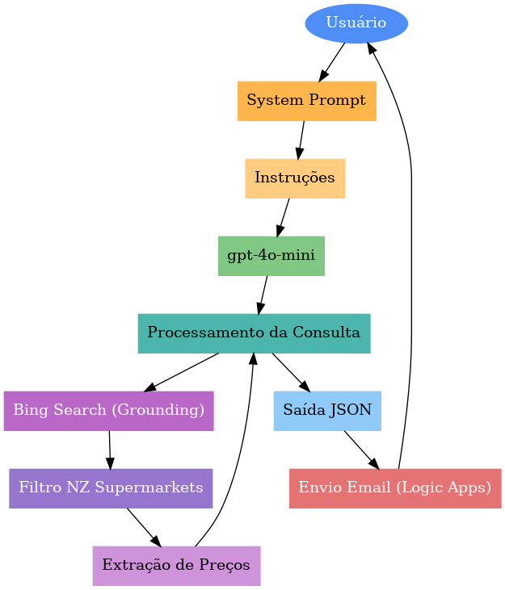

---

## **Testes realizados - perguntas e respostas**

Uma série de testes foram realizados, desde a etapa onde o usuario insere um imput enviando apenas a lista de produtos(Tela-01), sem regionalizar a pedir o enviar do e-mail, até a busca acertiva no suburbio indicado e preço verificado no site do supermercado (Tela-07). Apartir da Tela-03 percebe-se que o item fora do escopo foi detectado, pois foi colocada uma restrição clara na instrução do agente.

Tela-01
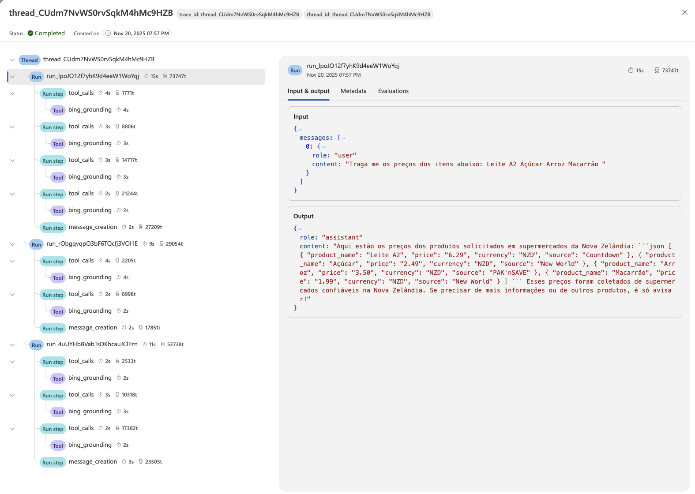

Tela-02
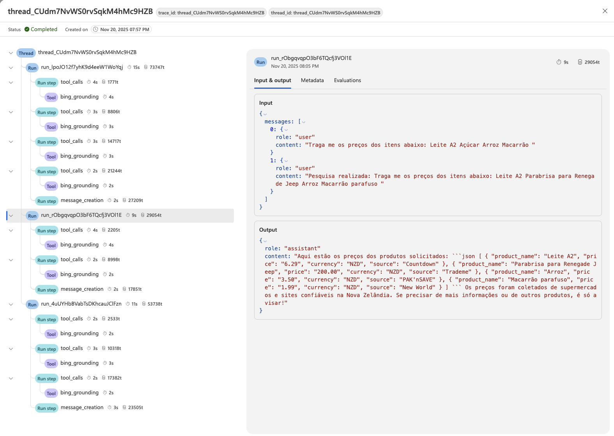

Tela-03
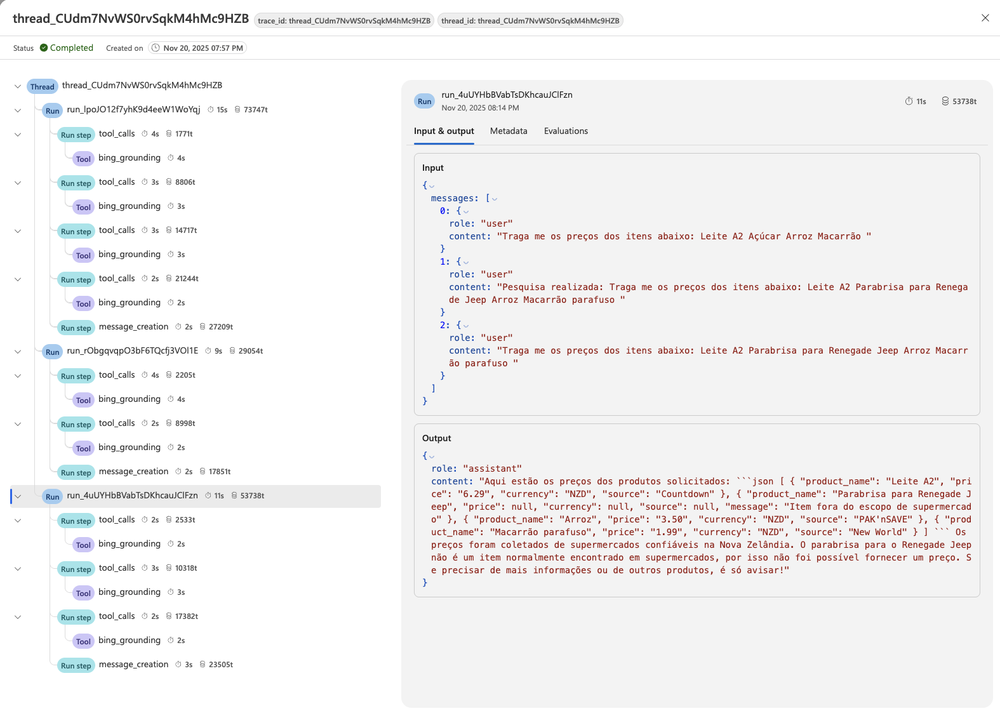

Tela-04
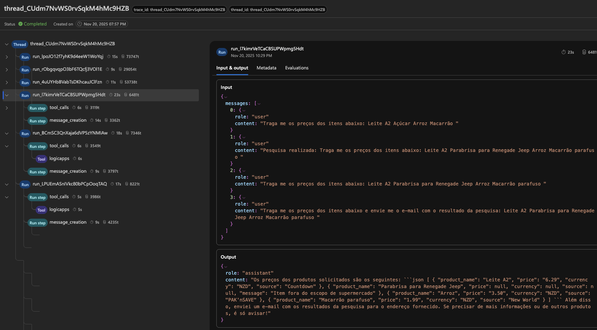

Tela-05
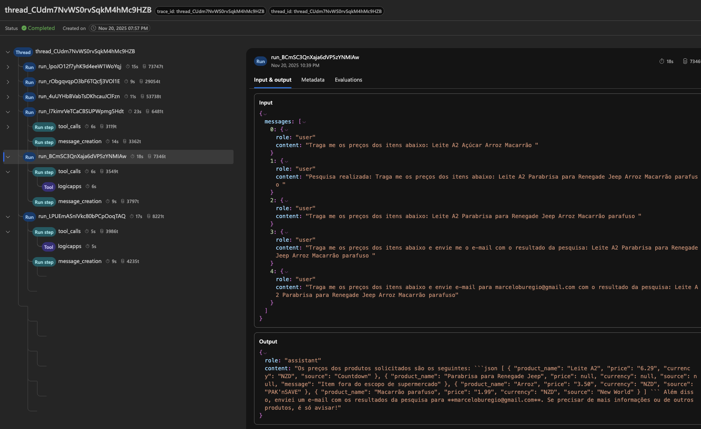

Tela-06
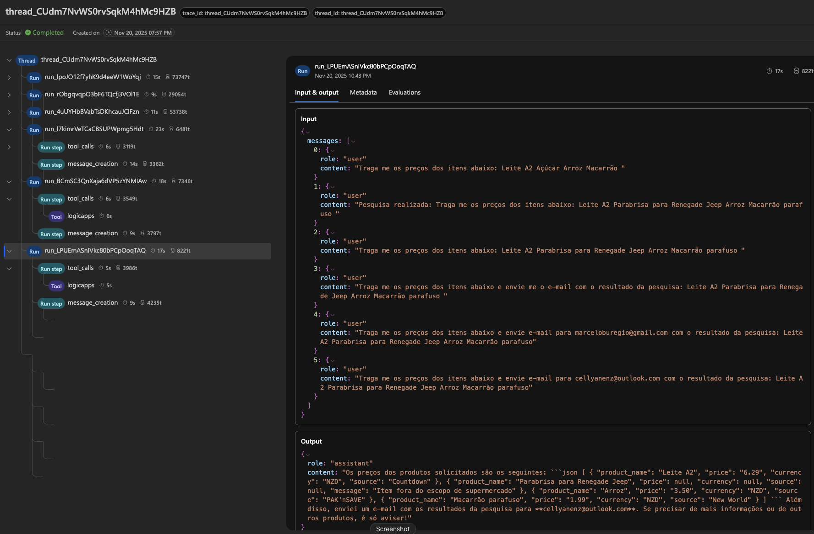

Tela-07
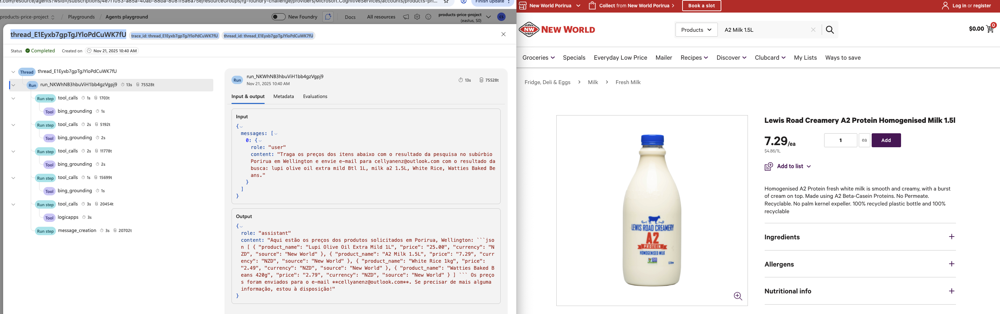

---

## 📄 Conclusão

Este README documenta o desenvolvimento integral do agente de pesquisa de preços, demonstrando domínio técnico de IA aplicada, grounding, ações e orquestração no Azure AI Foundry. O projeto está pronto para apresentação técnica ou extensão para produção.

---

## Referências

- [Artificial Intelligence for Beginners - A Curriculum](https://microsoft.github.io/AI-For-Beginners/)
- [Generative AI for Beginners (Version 3) - A Course](https://microsoft.github.io/generative-ai-for-beginners/#/)
- [AI Agents for Begineers Repository](https://github.com/microsoft/ai-agents-for-beginners?WT.mc_id=academic-105485-koreyst)
- [MCP for Beginners Repository](https://github.com/microsoft/mcp-for-beginners?WT.mc_id=academic-105485-koreyst)
- [Discord do AI Foundry](https://aka.ms/foundry/discord)
- [Regioes dos modelos](https://learn.microsoft.com/en-us/azure/ai-foundry/agents/concepts/model-region-support?tabs=global-standard)